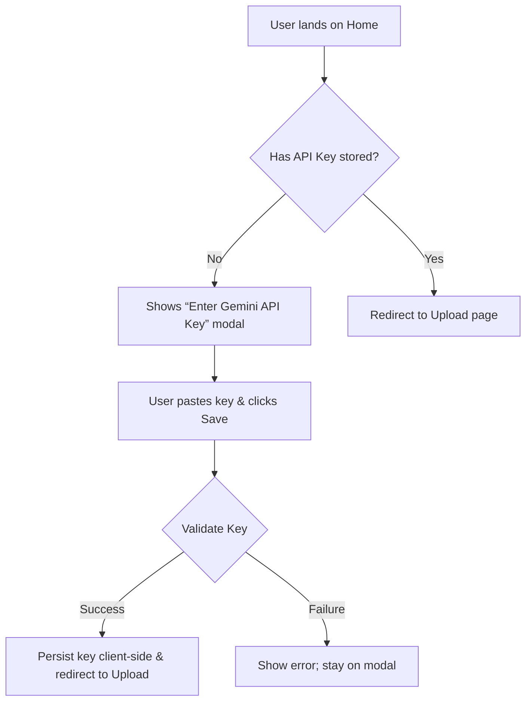
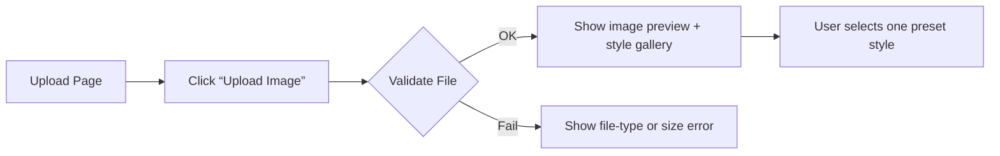
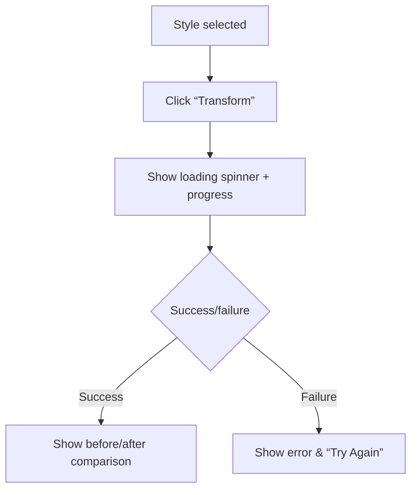
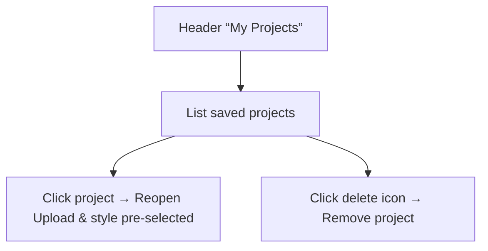

# User Experience Flows

## 1. Authentication & API Key Setup

### Sign-Up / API Key Entry

1. User arrives; prompted to enter their Gemini API key.
2. On valid key, store securely (Web Crypto) and send them to the Upload flow.
3. On invalid key, display inline error and retry option.

## 2. Image Upload & Style Selection

### Upload Flow

* **Entry:** User clicks “Upload Image.”
* **Validation:** Client checks type (JPEG/PNG) & size (<10 MB).
* **Preview:** Display uploaded image thumbnail.
* **Error:** On fail, show contextual message (“Unsupported format,” “File too large”).

### Style Selection

* Display a horizontal gallery of preset thumbnails (e.g., “Van Gogh,” “Watercolor,” “Neo-Tokyo”).
* On hover, show style name; on click, highlight selection.

## 3. Transformation & Result

### Transformation

* **Trigger:** User clicks “Transform.”
* **Call:** Frontend invokes Gemini Flash Preview endpoint with user’s key, image, style.
* **UX:** Show skeleton loader with animated progress indicator up to 5 s.

### Preview & Download

* Display two cards side-by-side: original vs. styled.
* Provide buttons: “Download PNG,” “Download JPEG,” and “Try Again” (resets style picker).

## 4. Settings & History

### Project History

* After each successful transform, auto-save timestamped entry in “My Projects.”
* Allow users to revisit or delete past transforms.
* Persist metadata (style used, timestamp, download count) client-side (IndexedDB).